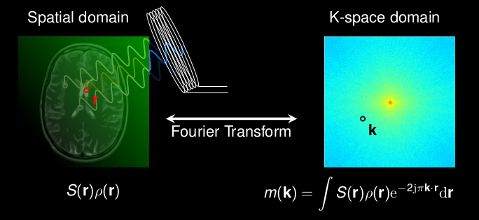

# MRI Simulation and Reconstruction

Matlab Framework for MRI Simulation and Reconstruction.

Written by [Matthieu Guerquin-Kern](mailto:guerquin-kern(AT)@crans(DOT).org) at the Biomedical Imaging Group (BIG), EPFL, Switzerland

## Outline

This package is a collection of Matlab functions that provides:
1. analytical and rasterized multi-channel MRI simulations of realistic phantoms and
2. a collection of basic and state-of-the-art reconstruction methods including an efficient wavelet-based non-linear one.

Demonstration and testing scripts are included. A detailed documentation is provided.

The analytical phantom simulation tools allow sound validations of reconstruction methods. The reconstruction framework is rather general and should be easy to adapt to any linear inverse problem. Wavelet transform and wavelet coefficients can be easily manipulated like Matlab's matrices and vectors.

## References

- M. Guerquin-Kern, L. Lejeune, K.P. Pruessmann, and M. Unser, "[Realistic Analytical Phantoms for Parallel Magnetic Resonance Imaging](https://hal.science/hal-01814155v1/)," IEEE Transactions on Medical Imaging, vol. 31, no. 3, pp. 626-636, March 2012.
- [Github project](https://github.com/Biomedical-Imaging-Group/realistic-analytical-phantom) dedicated to the analytical MRI simulation code and phantom design tools.
- [PhD thesis chapter](http://web.archive.org/web/20150101221026/https://bigwww.epfl.ch/guerquin/thesis/thesis007.html) on the general principles of image reconstruction in MRI.
- M. Guerquin-Kern, M. Haeberlin, K.P. Pruessmann, and M. Unser, "[A Fast Wavelet-Based Reconstruction Method for Magnetic Resonance Imaging](https://hal.science/hal-01813870v1)," IEEE Transactions on Medical Imaging, vol. 30, no. 9, pp. 1649-1660, September 2011.

## Software

### Requirements

Some functions have been written in C++. Most of them have fall-back counterparts written in Matlab language. The package was developed and tested under Linux and MacOSX platforms with Matlab R2011b. Partial testing demonstrated that the code is mainly compatible with GNU Octave 3.2.
- If you have a Unix-like operating system on a multi-core computer, you can use the POSIX-thread library to parallelize the computations. To do so,
    1. make sure this library is installed on your system such that Matlab's mex can find it;
    2. uncomment line 30 in [`myerfzparts_c.cpp`](code/private/myerfzparts_c.cpp).
- If you do not care much about calculation speed or if you use windows, or if things just do not work, just comment line 30 in [`myerfzparts_c.cpp`](code/private/myerfzparts_c.cpp).

### Download and install

Download the code [here](https://github.com/Biomedical-Imaging-Group/mri-reconstruction/archive/refs/heads/main.zip) (~351 KB).

Add the folder and subfolders in your matlab path. Some C++ sources are distributed with the code. To compile them as MEX binaries, simply run `make` in matlab prompt (make sure that you have a compiler installed using the mex setup).

You can start with the script [`DemoSimuAndRecon.m`](code/DemoSimuAndRecon.m) and continue with [`PerformTests.m`](code/PerformTests.m).

Please note that the MRI scanner data mentioned in the documentation is not shared publicly. Without these data, the two functions [`DemoBrainEPI.m`](code/DemoBrainEPI.m) and [`DemoBrainSpiral.m`](code/DemoBrainSpiral.m) will not work.

### Conditions of use

No conditions. This is public domain. See [LICENSE](LICENSE).

## Documentation

Download the documentation [here](doc/PackageDoc.pdf) (PDF, ~223 KB).

## Related Works

See [this project](https://github.com/Biomedical-Imaging-Group/realistic-analytical-phantom) for more details on the simulation part.

## Acknowledgements

- MEX files for wavelet transform by Cedric Vonesch, 2008. [Publicly distributed](http://web.archive.org/web/20250414235741/https://bigwww.epfl.ch/algorithms/mltldeconvolution/).
- MEX files for determining the points inside a polygon by Bruno Luong, 2010. [Publicly distributed](http://www.mathworks.com/matlabcentral/fileexchange/27840-2d-polygon-interior-detection)..
- Matlab code for n-dimensional "n permute k" problem by Matt Fig, 2009. [Publicly distributed](https://www.mathworks.com/matlabcentral/fileexchange/11462-n_permute_k).
- Matlab functions for the computation of MRI data with Bezier-defined phantoms by Laurent Lejeune under the author's supervision, 2010. See [here](http://web.archive.org/web/20220120151740/http://bigwww.epfl.ch/teaching/projects/abstracts/lejeune/index2.html).
- Marcel Leutenegger's instructions, [publicly distributed](https://documents.epfl.ch/users/l/le/leuteneg/www/MATLABToolbox/ErrorFunction.html), have been followed in the C++/MEX multi-threaded code that computes the error function of a complex variable.
- The Matlab and MEX files for gridding and NUFT computation have been coded by the author during spring 2012, inspired by L. Greengard and J.-Y. Lee (in Accelerating the nonuniform fast Fourier transform, SIAM Review, vol. 46, no. 3, pp. 443-454, 2004) and a partial implementation that is [publicly distributed](http://web.eecs.umich.edu/~fessler/irt/irt/nufft/greengard/) by Jeff Fessler.
